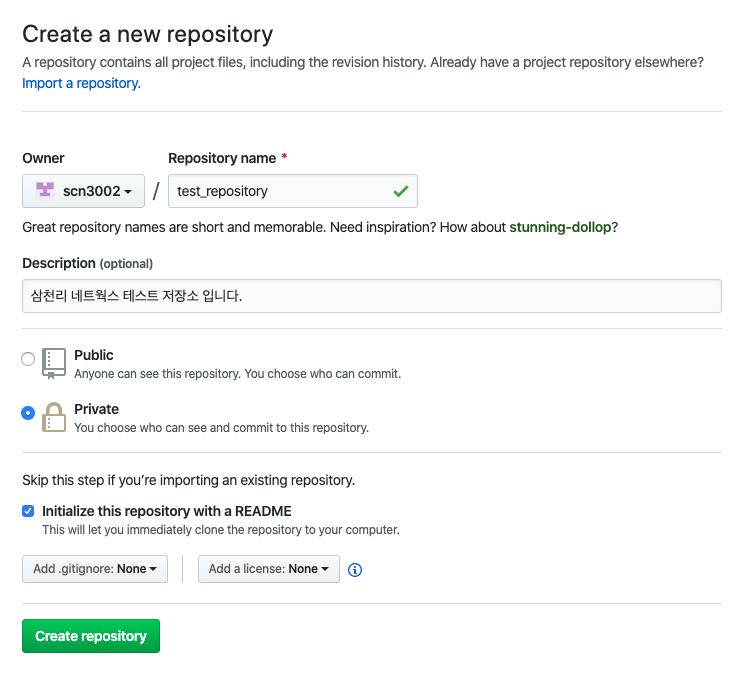
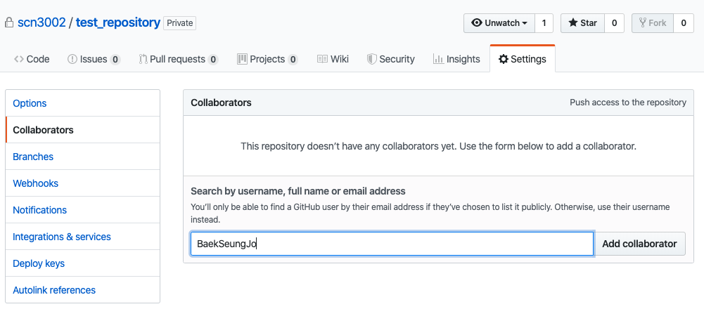
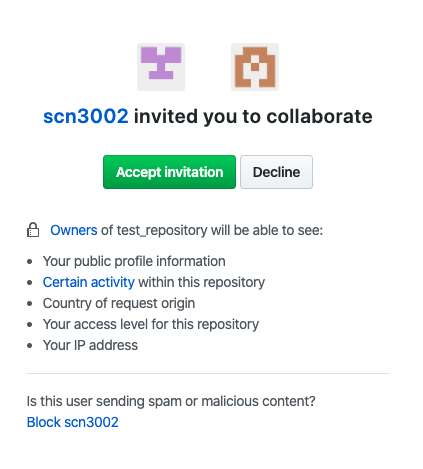
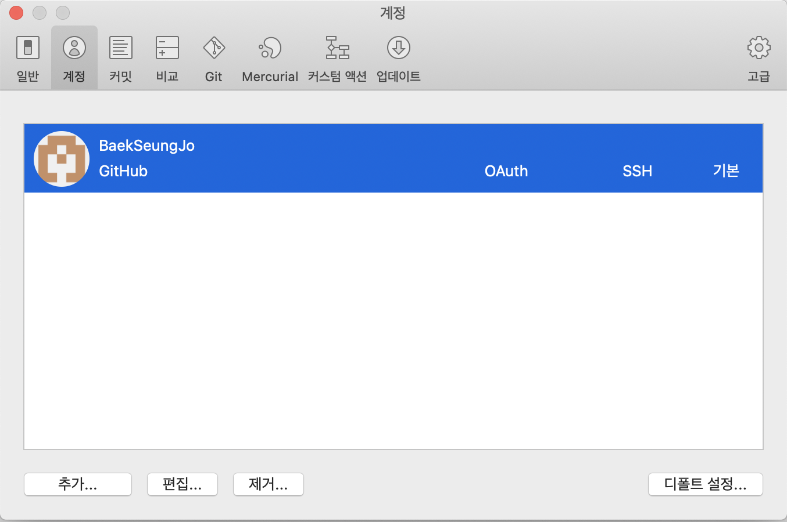
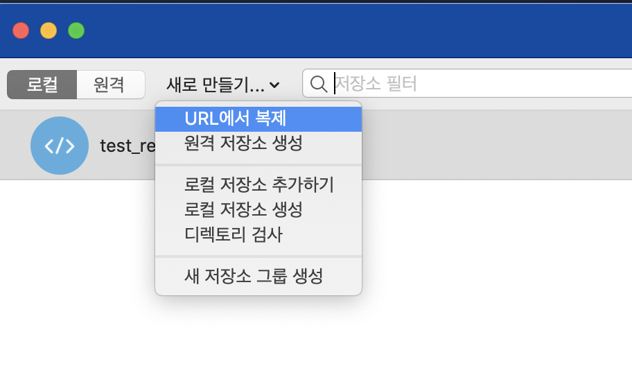
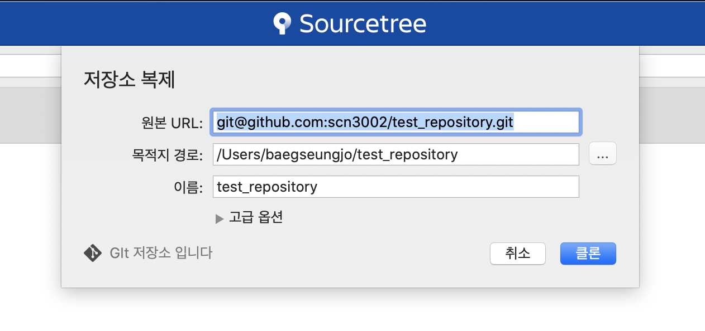

### Github Project 생성 및 연동 방법

## Repository 생성 
1. github.com 접속 
2. Organization 계정으로 로그인
3. New repository 클릭
 
4. Repository 정보 입력 및 생성

	* Repository name
	* Repository description 
	* public / private 선택 ( private 선택시 외부 공개 안됌)
	* Initialize this repository with a README 선택 
	* Create repository 버튼 클릭 
 

## Collaborators 추가 및 인증 
1. Setting -> Collaborators에서 collaborator 추가 

2. 초대받은 collaborator은 github에 연동된 이메일에서 초대 수락 

## SourceTree 설치 및 Github 계정 연동 
1. SourceTree 설치
2. 설정 -> 계정 탭에서 계정 추가

	* ssh를 이용한 github 연동 참조 : <https://jootc.com/p/201905122827>
3. SourceTree에 github 계정 연동 후 새로 만들기를 클릭하여 원격 저장소를 ssh 방식으로 연결 

